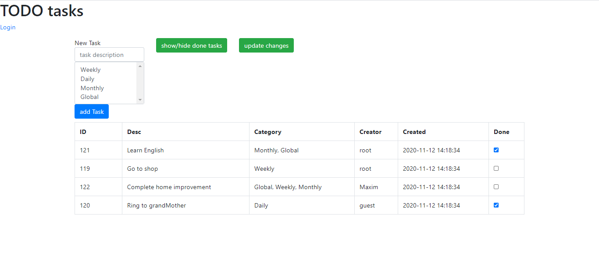
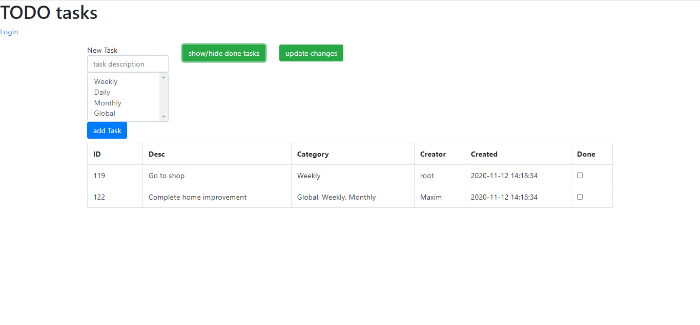

### Overall description:
Developing the application for learning by using hibernate and servlets.
Simple idea realisation of TODO tasks list.
If you pass a procedure of registration you give access save Task under your name.
There is a list of following opportunities for work with Tasks: create, edit, etc. in your cabinet.

## Architecture:
There is three-tier architecture is used in the project (presentation, business, and data access layers).

## Used following technologies:
1. For back-end:
    * servlets (lib: javax.servlet-api)
    * JSON (lib: Jackson)
    * fileupload (lib: apache fileupload)
    * postgresSQL (Framework: Hibernate)
2. For front-end
    * html(HTML5 + bootstrap 4)
    * js
    * jquery + ajax
3. For communication between a server and clients
    * HTTP + JSON

## Production overview:
- Own authorization system. (registration, authorization - completed done by pop-up windows.)
- Its creator is written in the tasks.
- You can hide completed tasks.
- You can select several categories via Ctrl + click.
- Easy task creation.
- The added task immediately enters the table on the client && server side.

*The main page*

*Hide done tasks*

